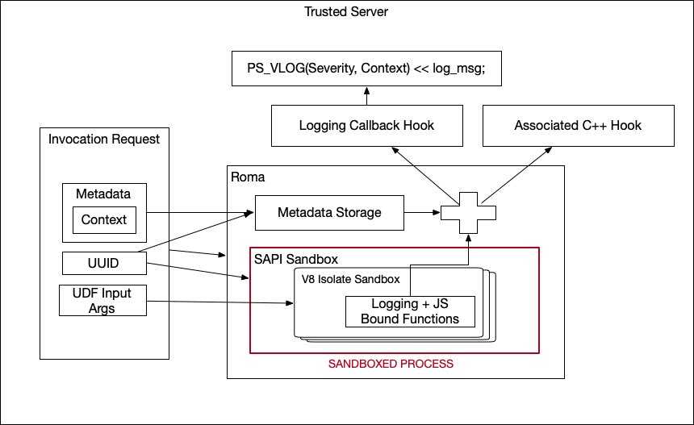

# Passing Privacy-Safe Metadata Through Roma

Roma provides functionality to pass metadata associated with invocation request execution to C++
hook functions used within User-Defined Functions (UDFs). This metadata is never serialized, nor
passed into the SAPI Sandbox, allowing for usage of this metadata in these C++ hook functions
without it ever being exposed to untrusted code of the UDF.

Metadata is templated to allow for flexibility regarding the type Roma clients wish to use to pass
said metadata, and defaults to `absl::flat_hash_map<std::string, std::string>`



-   See more information about Roma [here](README.md)
-   See examples of how to use this feature in
    [roma/roma_service/metadata_test.cc](/src/roma/roma_service/metadata_test.cc)

## Implementing Logging

To support logging from UDFs using privacy-safe metadata, the `Config<T>` used to initialize Roma
has been extended to also maintain a custom logging function as a private member.

To set this logging function, `Config<T>` exposes a new function, `Config<T>::SetLoggingFunction()`.

`Config<T>::SetLoggingFunction()` accepts
`absl::AnyInvocable<void(absl::LogSeverity, T, std::string_view) const>`, allowing clients to pass
in any function that accepts:

-   `absl::LogSeverity` - The severity of the log
-   `T` - The metadata associated with invocation request
-   `std::string_view` - The message to be logged

This function will be invoked whenever the provided Roma logging functions are invoked from JS code
(see [here](logging.md) for more details).

Logging is, by default, a no-op unless a logging function is set on the `Config<T>`.

## Optimizing Logging

To prevent the logging function from being invoked in the host process, Roma provides the ability to
configure Roma's minimum logging level within a UDF on a per InvocationRequest basis.

`execution_obj.min_log_level` can be set to prevent logs with severity < min_log_level from being
invoked from the sandbox, avoiding the RPC with the host process.

See examples below for how to use `execution_obj.min_log_level`.

## Use With Universal Logger (PS_VLOG)

Integrators using Roma can implement a logging function that calls
[PS_VLOG](/src/logger/request_context_logger.h) to conditionally log messages given verbosity and
context. To do so, Config and RomaService can be templated either on `RequestContext` directly, or
on some struct/class that maintains `RequestContext` as a member (henceforth referred to as
`ContextWrapper`).

This allows clients to construct `InvocationStrRequest<RequestContext>` or
`InvocationRequest<ContextWrapper>` to pass the `RequestContext` associated with Roma execution into
the UDF for passage into `PS_VLOG` without said `RequestContext` ever entering the SAPI sandbox,
ensuring that it is privacy-safe.

### Example 1: RequestContext

```cpp
using privacy_sandbox::server_common::log::RequestContext;

void LoggingFunction(absl::LogSeverity verbosity, RequestContext context,
                    std::string_view msg) {
  PS_VLOG(verbosity, context) << msg;
}
```

```cpp
Config<RequestContext> config;
config.SetLoggingFunction(LoggingFunction);
RomaService<RequestContext> roma_service(std::move(config));
```

```cpp
RequestContext context;
auto execution_obj =
        std::make_unique<InvocationStrRequest<RequestContext>>(
            InvocationStrRequest<RequestContext>{
              ...
              .metadata = context,
              // Only console.warn() and console.error() will invoke LoggingFunction
              .min_log_level = absl::LogSeverity::kWarning,
            });

auto status = roma_service.Execute(std::move(execution_obj), ...);
```

### Example 2: Wrapper containing RequestContext

```cpp
using privacy_sandbox::server_common::log::RequestContext;

void LoggingFunction(absl::LogSeverity verbosity, ContextWrapper wrapper,
                    std::string_view msg) {
  PS_VLOG(verbosity, wrapper.context) << msg;
}
```

```cpp
struct ContextWrapper {
 ...
 RequestContext context;
}

 Config<ContextWrapper> config;
 config.SetLoggingFunction(LoggingFunction);
 RomaService<ContextWrapper> roma_service(std::move(config));
```

```cpp
ContextWrapper wrapper = {
  .context = context;
};

auto execution_obj =
        std::make_unique<InvocationStrRequest<ContextWrapper>>(
            InvocationStrRequest<ContextWrapper>{
              ...
              .metadata = wrapper,
              // Only console.warn() and console.error() will invoke LoggingFunction
              .min_log_level = absl::LogSeverity::kWarning,
            });

auto status = roma_service.Execute(std::move(execution_obj), ...);
```
